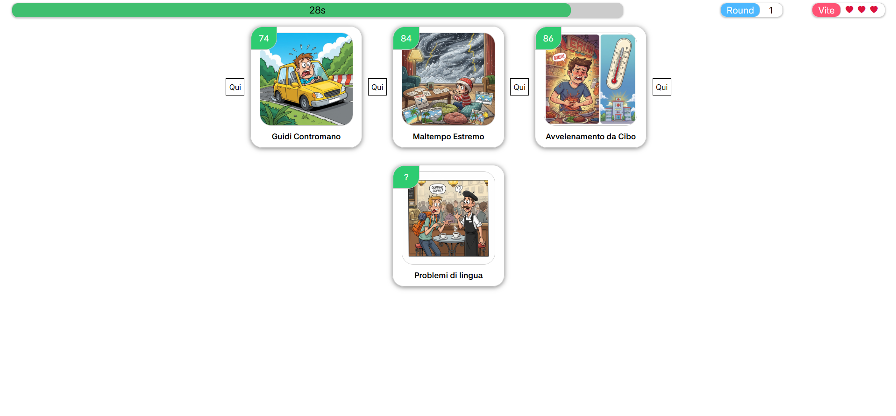
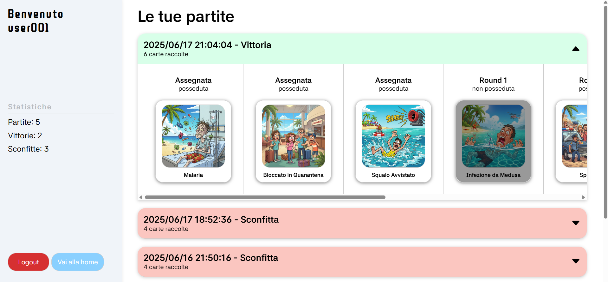

# "Stuff happens"

## React Client Application Routes

- Route `/`: homepage, from here is it possible to access to the other application's pages.
- Route `/rules`: rules page, here all the game's rules are described.
- Route `/match`: match page, in this page is it possible to play the match (demo or complete).
- Route `/login`: login page, in this page is it possible to submit user's credentials and login.
- Route `/profile`: profile page, all the user's information are represented in this page, including username, history of matches and logout button.
- Route `*`: Not Found page, if the user goes to any other route a not found page is sent.

## API Server
### Authentication
- POST `/api/sessions`
  - Description: authenticate a user and create a session containing it's information
  - Request body: a JSON object with the user's credentials, for example:
    ```
    {
      "username": "user001",
      "password": "password"
    }
    ```
  - Response: possible responses are:
    - `201 Created`: in case of success.
    - `401 Unauthorized`: in case of wrong credentials.
  - Response body: an object containing the id and username, in case of success
    ```
    {
      "id": 1,
      "username": "user001"
    }
    ```
- GET `/api/sessions/current`
  - Description: retrieve user's information from the current session
  - Response: possible reponses are:
    - `200 OK`: in case of success.
    - `401 Unauthorized`: in case the user is not logged.
  - Response body: a JSON objct containing user's information, in case of success
    ```
    {
      "username": "user001"
    }
    ```
- DELETE `/api/sessions/current`
  - Description: delete the current session and logout user
  - Response: possible responses are:
    - `200 OK`: in case of success.

### Cards
- GET `/api/cards/:id`
  - Description: return the card with the specified id
  - Response: possible responses are:
    - `200 OK`: in case of success.
    - `404 Not Found`: in case the card with this id does not exists.
    - `500 Internal Server Error`: in case of server error.
  - Response body: a JSON object representing the card retrieved, for example:
    ```
    {
      "id": 1,
      "name": "Nome 1",
      "misfortune": 10
    }
    ```
- POST `/api/cards/draw`
  - Description: return a random card (no yet selected), without the information about the misfortune rate, and save it in the session.
  - Response: possible responses are:
    - `200 OK`: in case of success.
    - `401 Unauthorized`: in case the user is not logged.
    - `404 Not Found`: in case the user is not playing or there are no cards available.
    - `409 Conflict`: in case the user has already drawed a card but not yet verified.
    - `500 Internal Server Error`: in case of server error.
  - Response body: a JSON object describing the card, for example:
    ```
    {
      "id": 1,
      "name": "Situation 1",
      "misfortune": null
    }
    ```
### Matches
- POST `/api/matches/init`
  - Description: initialize a game and return three cards (with the misfortune rate) and one card (without the misfortune rate)
  - Response: possible responses are:
    - `200 OK`: in case of success.
    - `404 Not Found`: in case no cards are found.
    - `500 Internal Server Error`: in case of server error.
  - Response body: a JSON array containing all the initial cards, for example:
    ```
      [
        {
          "id": 11,
          "name": "Bagagli in Ritardo",
          "misfortune": 22
        },
        {
          "id": 2,
          "name": "Sabbia Nelle Scarpe",
          "misfortune": 4
        },
        {
          "id": 5,
          "name": "Vicini rumorosi",
          "misfortune": 10
        },
        {
          "id": 35,
          "name": "Visto Sbagliato",
          "misfortune": null
        }
      ]
    ```
- POST `/api/matches/current/verify`
  - Description: verify that the position of misfortune rate choosen by the user is correct.
  - Request body: a JSON object containing information about the position, for example:
    ```
    {
      "index": 4
    }
    ```
  - Response: possible responses are:
    - `200 OK`: in case of success.
    - `404 Not Found`: in case the user is not playing any match or the card is not found.
    - `409 Conflict`: if the user has already verified the card.
    - `422 Unprocessable Entity`: in case "index" is not numeric.
    - `500 Internal Server Error`: in case of server error.
  - Response body: a JSON object containing information about success, for example:
    ```
    {
      "success": false
    }
    ```
- POST `/api/matches`
  - Description: save the game in the database
  - Response: possible responses are:
    - `201 Created`: in case of success.
    - `401 Unauthorized`: in case the user is not logged.
    - `404 Not Found`: if the user is not playing any match.
    - `500 Internal Server Error`: in case of server error. 
- GET `/api/matches`
  - Description: return all the user's match ordered by date.
  - Response: possible responses are:
    - `200 OK`: in case of success.
    - `401 Unauthorized`: in case the user is not logged.
    - `500 Internal Server Error`: in case of server error. 
  - Response body: an array containing all the matches' information, for example:
    ```
    [
      {
        "id": 40,
        "win": 1,
        "userID": 10,
        "date": "2025/06/03T21:13:00",
        "cards": [
          {"id": 2, "name": "Card 2", round: 1, possessed: 0},
          ...
        ]
      },
      ...
    ]
    ```
## Database Tables

- Table `User` - contains id, username, password, salt 
- Table `Card` - contains id, name, misfortune
- Table `Match` - contains id, win, userID, date
- Table `Card_Match` - contains cardID, matchID, round, possessed

## Main React Components

- `Home` (in `Home.jsx`): homepage, it returns the jsx of the home, including buttons to navigate the web application
- `Rule button` (in `Home.jsx`): button that once clicked navigate to /rules.
- `Play button` (in `Home.jsx`): button that once clicked navigate to /match.
- `Profile button` (in `Home.jsx`): button that once clicked navigate to /profile.
- `Match` (in `Match.jsx`): return the jsx that contains the skeleton of the match, such as timebar, roundbar, lifebar and cards.
- `Summary` (in `Math.jsx`): return the jsx that show the summary a finished match.
- `Card` (in `Card.jsx`): return the jsx that show card information.
- `LoginForm` (in `Authentication.jsx`): return the jsx that contains the form to validate user.
- `LogoutButton` (in `Authantication.jsx`): button that once clicked logout the user.
- `Profile` (in `Profile.jsx`): return the jsx that show all information of user, including it's matches.


(only _main_ components, minor ones may be skipped)

## Screenshot
### Match

### History


## Users Credentials

- username: `user001`, password: `password`
- username: `user002`, password: `password`
